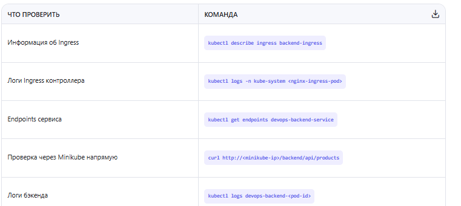

полезные команды

kubectl describe hpa devops-backend-hpa
kubectl get nodes
kubectl get deployments
kubectl get pods
kubectl get hpa
kubectl get events

запустить миникуб minikube start --driver=docker

проверить доступен ли кластер kubectl cluster-info  

minikube ip

раскатить последний лейтест kubectl rollout restart deployment/devops-frontend

прокидка портов  kubectl port-forward svc/kube-prometheus-stack-grafana 3000:80
